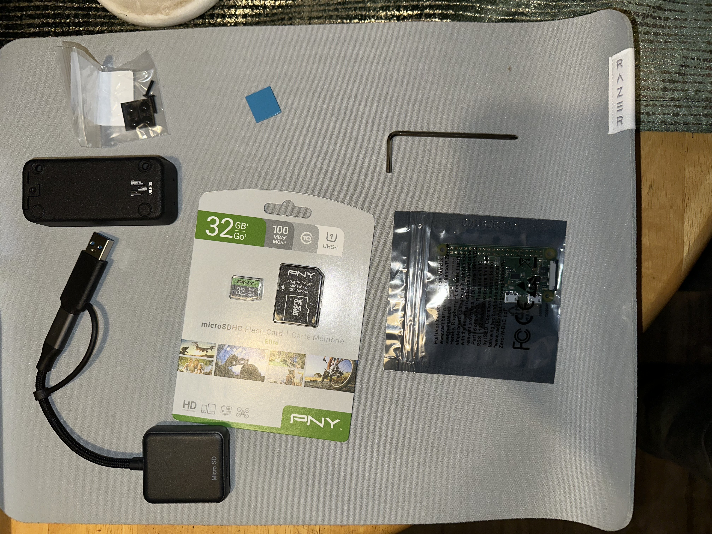

# Pi-hole Network-Wide Ad & Tracker Blocker on Raspberry Pi Zero W

**Completed December 2025**  
Fully functional Pi-hole deployment that blocks ads and trackers across my entire home network (15+ devices including phones, laptops, smart TVs, and IoT) with a sustained **~40% block rate** using the hagezi Pro++ blocklist. Demonstrates headless Linux setup, DNS hardening, and network troubleshooting.

GitHub: https://github.com/Aledtz/pi-hole-network-wide-ad-blocker

## Quick Start Summary
1. Assemble hardware (Pi Zero W + case).
2. Flash OS Lite with Imager (pre-config Wi-Fi/SSH/static IP 192.168.1.224).
3. Install Pi-hole via curl script; select Cloudflare upstream + logging.
4. Harden with hagezi Pro++ blocklist and encrypted-DNS blocking.
5. Override router DNS for network-wide effect.
6. Monitor dashboard for 40%+ blocking.

## Key Features & Skills Demonstrated
- Headless Raspberry Pi OS Lite (64-bit) deployment via Raspberry Pi Imager with pre-configured Wi-Fi, SSH, and static IP (`192.168.1.224`)
- Permanent static IP configuration in `/etc/dhcpcd.conf`
- Pi-hole v5 installation + aggressive blocklist integration (440k+ domains)
- Encrypted-DNS bypass prevention (`block-encrypted-dns=true`)
- Router-level DNS override for true network-wide protection
- Full documentation with 33 screenshots and config snippets

## Results
- **440,940+ domains blocked**
- **~40% of all DNS queries blocked** (real-world average)
- Smart TVs and mobile devices now fully filtered (no DoH/DoT bypass)

## Hardware
- Raspberry Pi Zero W (2017)
- 3D-printed protective case
- 32 GB microSD (PNY Elite)

## Step-by-Step Configuration Guide
Follow this guide to replicate the setup. All 33 screenshots illustrate each phase in detail – fork and build your own!

### Phase 1: Hardware Preparation & Unboxing (Screenshots 01-06)
Gather and assemble components for a compact, reliable build.

 – Starting point: Listing all parts for the Pi-hole build.  
 – Opening the Pi Zero W package to inspect board and connectors.  
 – Preparing the 32 GB microSD for OS flashing.  
 – Securing the Pi board into the 3D-printed case base.  
 – Installing thermal management for sustained operation.  
 – Sealing the case for dust protection and portability.

### Phase 2: OS Flashing & Headless Configuration (Screenshots 07-12)
Use Raspberry Pi Imager for zero-touch setup (Wi-Fi, SSH, hostname).

 – Opening the tool and selecting the Pi Zero W device.  
 – Opting for headless version to minimize resource use.  
 – Enabling SSH and setting username/password for remote access.  
 – Pre-configuring network credentials for automatic connection.  
 – Assigning a custom hostname for easy SSH discovery.  
 – Monitoring the flash process; verify integrity post-write.

### Phase 3: First Boot, SSH Access & System Prep (Screenshots 13-18)
Power on, connect via SSH, and update the base OS.

 – Booting the Pi for the initial headless startup.  
 – Logging in remotely: `ssh username@pihole-local.local`.  
 – Fetching latest package lists for security and stability.  
 – Applying system updates to patch vulnerabilities.  
 – Confirming IP assignment and ping to router (192.168.1.1).  
 – Preparing dependencies for Pi-hole installer.

### Phase 4: Pi-hole Installation (Screenshots 19-24)
Run the automated script with custom selections for optimal setup.

 – Executing `curl -sSL https://install.pi-hole.net | bash`.  
 – Reviewing terms and starting the guided process.  
 – Selecting secure, fast recursive DNS.  
 – Activating logs for monitoring and troubleshooting.  
 – Choosing initial unified blocklist for broad coverage.  
 – Warning to configure persistent IP before proceeding.

### Phase 5: Static IP, Hardening & Blocklist Updates (Screenshots 25-29)
Secure the network config and enhance blocking capabilities.

 – Adding static IP lines for wlan0 interface (192.168.1.224/24).  
 – Restarting Pi to lock in the configuration.  
 – Integrating ~550k aggressive domains for max ad/tracker blocking.  
 – Compiling and downloading the full blocklist database.  
 – Appending `block-encrypted-dns=true` to pihole-FTL.conf and restarting service.

### Phase 6: Network Deployment, Testing & Results (Screenshots 30-33)
Override router DNS, test across devices, and review metrics.

 – Logging into 192.168.1.1 to modify DHCP settings.  
 – Updating primary/secondary DNS to 192.168.1.224 and 1.1.1.1.  
 – Running `ipconfig /flushdns` on Windows devices for immediate effect.  
 – Live metrics showing 440k+ domains active and real-time blocking rate.

**Pro Tip**: For locked routers, enable Pi-hole's DHCP server (`pihole enable dhcp`). Monitor via http://192.168.1.224/admin and whitelist false positives as needed.

Browse the complete [screenshots folder](screenshots/) with all 33 images for extras like query logs and error troubleshooting.

## Config Snippets
- [Static IP – 192.168.1.224](config-snippets/dhcpcd.conf-static-ip.txt)
- [Encrypted DNS blocking](config-snippets/pihole-FTL.conf-encrypted-dns.txt)
- [Full install & hardening script](config-snippets/install-commands.sh)

This project demonstrates hands-on Linux administration, DNS/networking, troubleshooting, and documentation — skills directly applicable to IT Support and Systems Administration roles.

Ready to deploy your own? Fork this repo and follow the steps!
